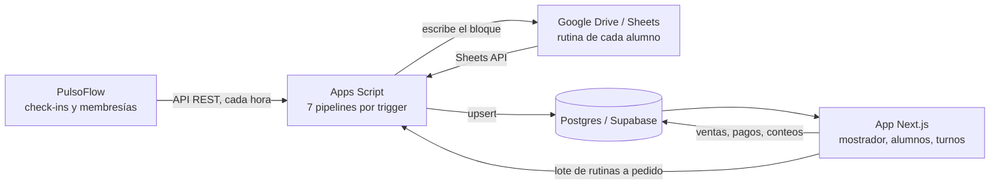
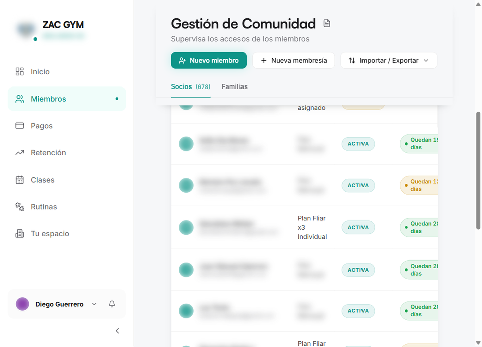
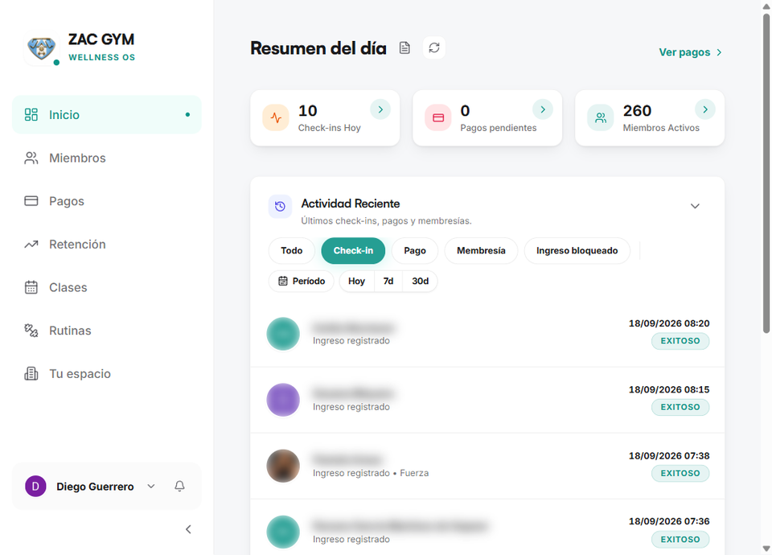
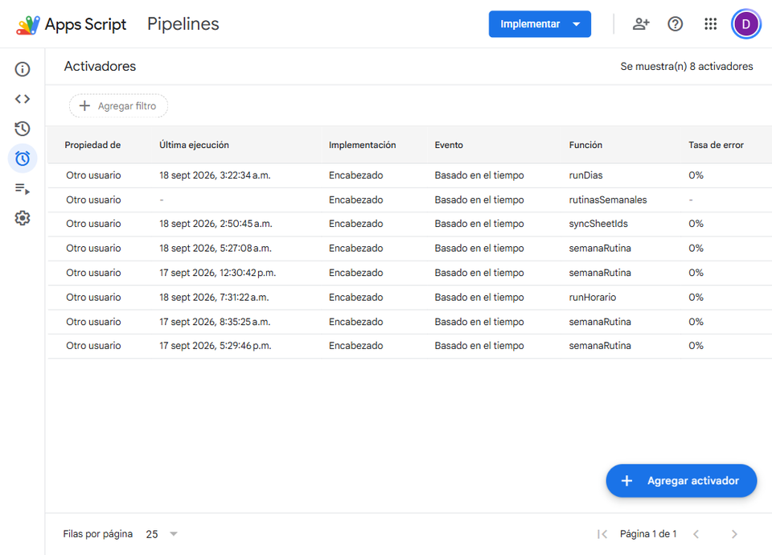
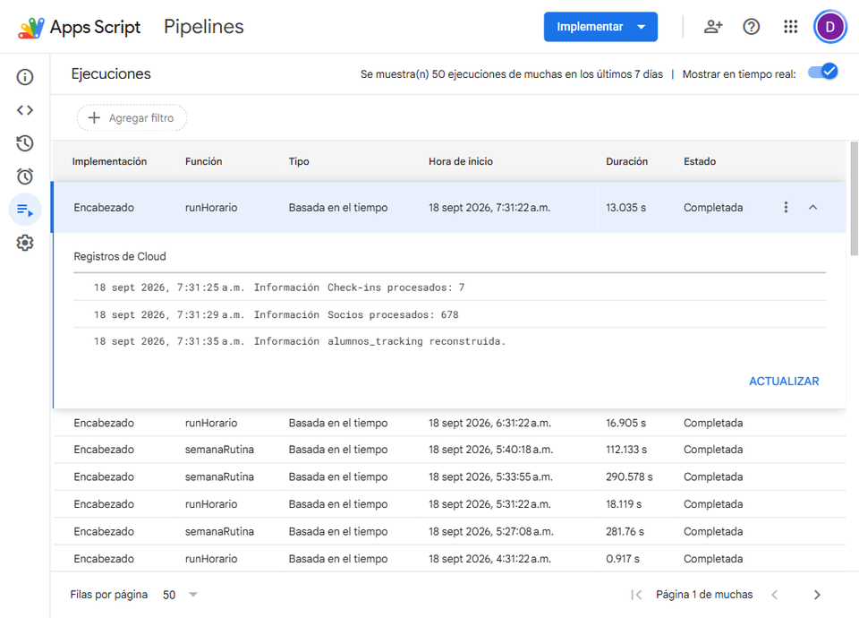
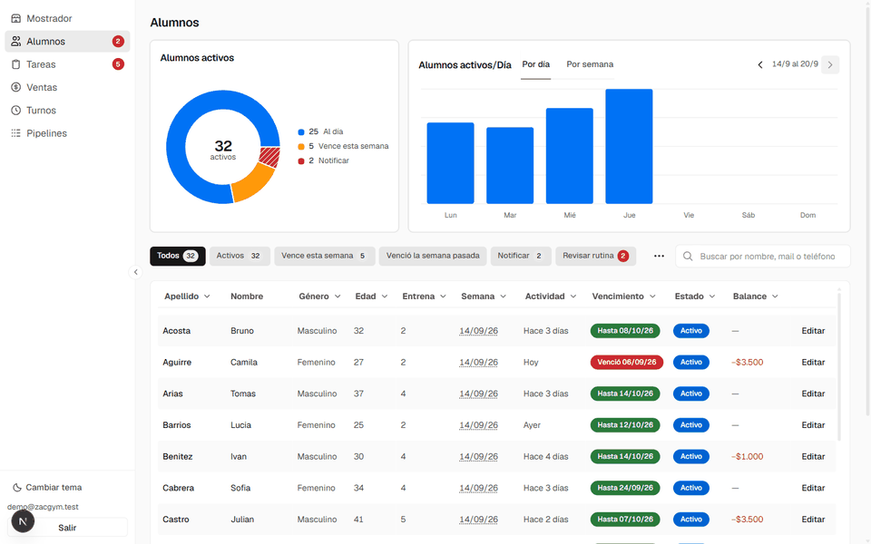
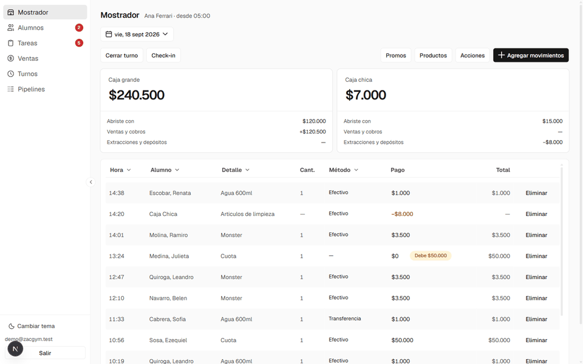
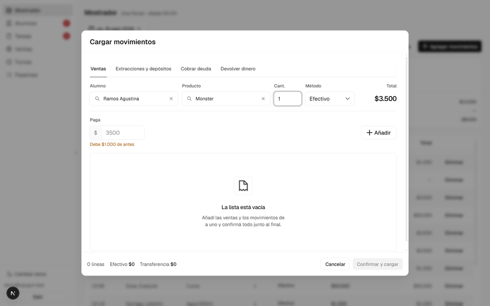

# ZacGym — sistema de gestión

Sistema interno para un gimnasio de ~270 alumnos activos. Junta en un solo lugar
lo que antes estaba repartido entre una app de terceros, un montón de planillas
de Google y la memoria de la gente del mostrador, y automatiza lo que se hacía a
mano.

Ahorra unas **40 horas de trabajo manual por semana**, lo usan **6 personas**
todos los días y se desarrolló en **2 semanas**.

---

## El problema

ZacGym trabajaba con dos herramientas separadas:

- **Google Sheets**, donde vive la rutina de entrenamiento de cada alumno, una
  planilla por persona.
- **PulsoFlow**, la app donde queda registrado quién viene a entrenar. Cada vez
  que alguien entrena queda un **check-in**: la marca de que esa persona vino ese
  día.

Al ser un gimnasio chico y que creció rápido, no hay una recepción con ingreso
por huella dactilar, así que nadie sabía con certeza quién tenía que pagar. La
gente se olvidaba, o se hacía la distraída, y había que estar recordándoselo uno
por uno.

Y todos los fines de semana el dueño —que entrena al 90% de la gente del
gimnasio— se sentaba a actualizar las rutinas a mano, una planilla por vez. Eran
sábado y domingo completos.

## Lo que cambió

| | Antes | Ahora |
|---|---|---|
| **Actualizar las rutinas** | ~20 horas por fin de semana, a mano | Un proceso los domingos a las 3 AM. El lunes ya están |
| **Saber quién debe** | El 40% de los alumnos activos debía algo, y había gente debiendo 2 meses | ~7%, y nadie debe más de 2 semanas |
| **Listado de alumnos** | Una planilla cargada a mano donde el que faltaba quedaba invisible | Se arma solo cruzando PulsoFlow con Drive |
| **Caja y stock** | "Falta plata" o "faltan aguas" era una sospecha | Cada turno cuenta y el sistema registra cada diferencia |
| **Cuánto va a entrar esta semana** | No se sabía | Se estima con los vencimientos y la cobranza |

## Cómo funciona



Los pipelines no corren dentro de la app: son proyectos de Apps Script con
triggers de Google que escriben en la misma base que lee la app.

---

# 1. Sacarle los datos a PulsoFlow

Esto es lo que habilita todo lo demás, y fue lo más difícil.

PulsoFlow es una **app cerrada**. No tiene API pública ni documentada, y la única
salida de datos que ofrece es un "Descargar Excel" de la lista de socios, a mano,
desde la pantalla de Miembros.



Eso no alcanza para nada de lo que hacía falta. Un Excel que alguien baja a mano
no sirve para un proceso que corre cada hora, y **los check-ins no se exportan**:
el histórico de asistencias —justo el dato que necesitan las rutinas
automáticas— solo se puede mirar en pantalla.



**Lo que hice:** analicé cómo se comunica la app con su propio servidor para
entender qué endpoints usa y qué devuelve cada uno, y desarrollé un script que
extrae los datos en masa.

Los tres endpoints que importan:

| Endpoint | Qué devuelve |
|---|---|
| `GET /services` | Las sedes de la cuenta. El `id` de acá es la llave de los otros dos. |
| `GET /checkins/service/{id}` | Los check-ins, paginados y filtrables por fecha. |
| `GET /memberships/service/{id}` | Las membresías: plan, estado, vencimiento y contacto. |

**La sesión.** El login de PulsoFlow es por código de un solo uso al mail, no por
contraseña, y un proceso que corre 19 veces por día no puede depender de que
alguien lea un mail. Ese paso se hace **una sola vez**, a mano, y de ahí en
adelante cada corrida cambia el refresh token por un access token fresco y
**guarda el nuevo**, porque el anterior queda invalidado al usarlo:

```js
/** Rota el refresh token y devuelve un access token fresco. */
function getAccessToken_() {
  const props = PropertiesService.getScriptProperties();
  const refreshToken = props.getProperty(PROP_REFRESH_TOKEN);
  if (!refreshToken) throw new Error('No hay sesion. Corre requestOtp + verifyOtp primero.');
  const res = UrlFetchApp.fetch(CONFIG.PF_AUTH_URL + '/auth/v1/token?grant_type=refresh_token', {
    method: 'post',
    contentType: 'application/json',
    headers: { apikey: CONFIG.PF_ANON_KEY },
    payload: JSON.stringify({ refresh_token: refreshToken }),
    muteHttpExceptions: true,
  });
  const data = JSON.parse(res.getContentText());
  props.setProperty(PROP_REFRESH_TOKEN, data.refresh_token); // el viejo queda invalido
  return data.access_token;
}
```

Es una cadena: si una corrida se queda con un token nuevo y no lo guarda, la
siguiente ya no entra.

**La bajada es incremental.** Cada corrida arranca en el último check-in que ya
está guardado y pide de ahí en adelante, paginando de a 200. El estado vive en la
base, no en el script: si una corrida falla, la siguiente sigue donde quedó sin
que nadie arregle nada.

**El histórico** se bajó de una con un script aparte
([`pipelines/backfill/fetch_checkins.py`](pipelines/backfill/fetch_checkins.py)),
así que la serie está completa desde el día cero.

Así se ve corriendo, del lado de Apps Script — ocho activadores por reloj, con su
tasa de error:



Y una corrida terminada, con las tres líneas de los tres pipelines que corren
cada hora: bajar los check-ins nuevos, bajar las membresías y rearmar el cruce.



En el listado de ejecuciones se nota el corte por horario: las corridas de la
madrugada duran menos de un segundo porque salen sin hacer nada, y las del
horario del gimnasio entre 13 y 18 segundos.

La app tiene además su propia pantalla de monitoreo, que marca el atraso
comparando la última corrida de cada pipeline contra el horario esperado:


→ En detalle: [docs/extraccion-pulsoflow.md](docs/extraccion-pulsoflow.md)

---

# 2. Las rutinas se actualizan solas

Los domingos a las 3 AM, un trigger arma la cola con **todos los que hicieron al
menos un check-in desde el lunes**, abre la planilla de cada uno en Drive y le
avanza el bloque de entrenamiento. El que no llegó al mínimo de días **repite**:
el mismo trabajo, con la fecha corrida una semana.

| Entrena | Tiene que haber entrenado para avanzar |
|---|---|
| 1 o 2 días | 1 día |
| 3 o 4 días | 2 días |
| 5 o 6 días | 3 días |

Cuenta **días distintos, no check-ins**: entrar dos veces el mismo día es un día.

Son unas 230 planillas por semana, y Apps Script corta cualquier ejecución a los
6 minutos. La corrida está armada para que eso no importe: no guarda la cola —la
rearma en cada ejecución salteando a los que ya tienen la semana escrita—, se
reprograma sola a los 60 segundos si corta, aísla la planilla que falla para que
no trabe al resto y manda un mail con el resumen al terminar.

**Esas 20 horas de fin de semana pasaron a cero.**

Para los casos sueltos —el que volvió de viaje, el alumno nuevo— el mostrador
tiene un botón que dispara el mismo motor para hasta 10 alumnos, sin tocar
código:


→ En detalle: [docs/rutinas.md](docs/rutinas.md)

---

# 3. El listado de alumnos se mantiene solo


En una fila está lo que antes estaba en tres lugares distintos: cuántos días
entrena, en qué semana de rutina va, cuándo vino por última vez, cuándo le vence
la cuota y cuánto debe. Los filtros de arriba son las preguntas de todos los
días: quién vence esta semana, quién venció la semana pasada, a quién hay que
notificar, qué rutinas hay que revisar.

Las membresías bajan de PulsoFlow cada hora. Las planillas se cruzan solas con su
alumno: un barrido diario de Drive busca los archivos que terminan en
`" - Rutina"` y resuelve de quién es cada uno por el nombre del archivo y, si no
engancha, por los mails con los que está compartido.

Antes eso dependía de una planilla "Control de usuarios" cargada a mano, donde el
alumno que faltaba quedaba invisible **sin que nada fallara**: de 49 alumnos
activos que figuraban sin días de entrenamiento, 48 simplemente no tenían fila
ahí.

La ficha junta los datos, el vencimiento, el balance y todo lo que compró y pagó:



→ En detalle: [docs/alumnos.md](docs/alumnos.md)

---

# 4. El mostrador: ventas, cobranza y deudas



Todo lo que se carga queda pegado al turno abierto y al alumno. Lo que el sistema
resuelve solo:

- **Avisa la deuda en el momento**, al elegir al alumno, antes de cobrarle.
- **Separa la venta del pago**: una venta puede quedar fiada, pagada en parte o
  pagada con dos métodos. Cobrar una deuda vieja no altera la caja del día en que
  se hizo la venta: la plata cuenta el día que entra al cajón.
- **Congela el precio**, así actualizar el catálogo no reescribe lo ya vendido.
- **Exige un turno abierto** para cargar cualquier cosa, que es lo que después
  permite saber quién anotó qué.



Esto es lo que ordenó la cobranza: pasar del 40% de alumnos activos debiendo algo
—con gente debiendo dos meses y viniendo igual— a ~7% y nadie con más de dos
semanas.

→ En detalle: [docs/mostrador.md](docs/mostrador.md)

---

# 5. Caja y stock

Cada turno **abre y cierra contando**, y el sistema compara lo contado contra lo
que esperaba.


Si algo no cuadra el cierre no se bloquea, pero tampoco pasa en silencio: hay que
escribir la confirmación a mano para poder cerrar igual, y la diferencia queda
guardada con el turno, el producto y el responsable.


Una diferencia en la **apertura** viene de antes de ese turno; una en el
**cierre** pasó durante. Esa distinción es la que permite ubicar el problema en
el tiempo. Y mirado por producto en vez de por turno, es lo que detecta un
faltante sistemático: **un faltante suelto es un error de conteo, el mismo
producto faltando seis veces no.**

→ En detalle: [docs/caja-y-stock.md](docs/caja-y-stock.md)

---

## Stack

- **App**: Next.js 16 (App Router), React 19, TypeScript strict, Tailwind v4 con
  el design system Geist.
- **Base**: Postgres en Supabase. La lógica de plata y stock vive en la base
  —funciones, vistas y triggers— y no en la pantalla, así que no se puede saltear
  cargando por otro lado.
- **Pipelines**: Google Apps Script, 7 procesos con triggers de reloj.
- **Deploy**: Vercel.

## Ver el sistema funcionando

Se levanta en cualquier máquina con Docker, con datos de demostración
inventados —ningún alumno, importe o teléfono de las capturas corresponde a una
persona real—:

```bash
pnpm install
pnpm db:start
pnpm db:reset
docker exec -i supabase_db_zacgym-management-system \
  psql -U postgres -d postgres < supabase/demo/seed-demo.sql
pnpm dev
```

Entrar con `demo@zacgym.test` / `demo-zacgym-2026`. Detalle en
[docs/demo.md](docs/demo.md).

## Documentación

| Documento | De qué trata |
|---|---|
| [Extracción de datos de PulsoFlow](docs/extraccion-pulsoflow.md) | Cómo se le sacan los datos a una app cerrada, y qué se hace con ellos. |
| [Rutinas](docs/rutinas.md) | La corrida semanal automática y el lote a demanda. |
| [Alumnos](docs/alumnos.md) | El listado que se mantiene solo y la ficha. |
| [Mostrador](docs/mostrador.md) | Ventas, cobranza y deudas. |
| [Caja y stock](docs/caja-y-stock.md) | Turnos, conteos y diferencias. |
| [Demo local](docs/demo.md) | Cómo levantarlo con datos de demostración. |
| [Desarrollo](docs/desarrollo.md) | Arranque, puertos, comandos, cuentas y deploy. |
| [Pipelines](pipelines/README.md) | Los 7 pipelines uno por uno, con sus horarios y sus casos borde. |
