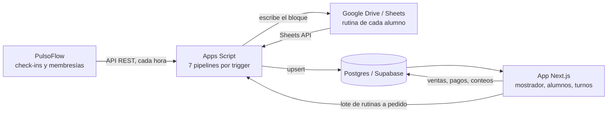

# ZacGym — cómo funciona el sistema

ZacGym es un gimnasio que trabajaba con dos herramientas separadas: **Google
Sheets**, donde vive la rutina de cada alumno, y **PulsoFlow**, la app donde
queda registrado quién viene a entrenar. Cada vez que alguien entrena queda un
check-in, que es el registro de que esa persona vino ese día.

Al ser un gimnasio chico y que creció rápido, no hay una recepción con ingreso
por huella dactilar, así que nadie sabía con certeza quién tenía que pagar. La
gente se olvidaba, o se hacía la distraída, y había que estar recordándoselo uno
por uno.

Este sistema es el lugar donde esas dos fuentes y lo que se carga en el
mostrador terminan juntas, para que los datos puedan cruzarse entre sí.

## Lo que hace, en una pantalla

| | |
|---|---|
| **Actualiza las rutinas solo** | Los domingos cruza los check-ins de la semana con la planilla de cada alumno y le avanza el bloque de entrenamiento. Antes eran ~20 horas de trabajo manual por fin de semana. |
| **Centraliza los datos** | Extrae de PulsoFlow y de Google Sheets, y suma lo que se carga en el mostrador. De ahí sale saber quién debe, cuánto y desde cuándo. |
| **Registra ventas, deudas y stock** | Cada turno abre y cierra contando caja y mercadería, y el sistema compara lo contado contra lo que esperaba. |
| **Mantiene el listado de alumnos al día** | Las membresías bajan de PulsoFlow cada hora; las planillas de Drive se cruzan solas con su alumno. |

## Mapa

Nada de los pipelines corre dentro de la app: son proyectos de Apps Script con
triggers de Google que escriben en la misma base que lee la app. La única parte
que se ejecuta a pedido y no por reloj es el lote de rutinas del mostrador.

## Índice

| Documento | De qué trata |
|---|---|
| [Extracción de datos de PulsoFlow](extraccion-pulsoflow.md) | Cómo se le sacan los datos a una app cerrada, y qué se hace con ellos. |
| [Rutinas](rutinas.md) | La corrida semanal automática y el lote a demanda del mostrador. |
| [Alumnos](alumnos.md) | El listado que se mantiene solo y la ficha de cada uno. |
| [Mostrador: ventas, cobranza y deudas](mostrador.md) | Lo que se carga en el día a día. |
| [Caja y stock](caja-y-stock.md) | Turnos, conteos y diferencias. |
| [Demo local](demo.md) | Cómo levantar el sistema con datos de demostración. |
| [Desarrollo](desarrollo.md) | Arranque, puertos, comandos, cuentas y deploy. |

Detalle técnico de cada pipeline, sus horarios y sus casos borde:
[`pipelines/README.md`](../pipelines/README.md).

## Números

- ~270 alumnos activos; el dueño entrena al 90% de la gente que va al gimnasio.
- ~20 horas por semana que se dejaron de perder actualizando rutinas a mano.
- ~20 horas por semana más entre cobranza y carga de pagos.
- El 40% de los alumnos activos debía algo antes del sistema; hoy ronda el 7%,
  y nadie debe más de dos semanas.
- Lo usan 6 personas todos los días. Se desarrolló en 2 semanas.

> Las capturas y los GIFs de esta documentación salen de la
> [demo local](demo.md), con datos inventados. Ningún alumno, importe o teléfono
> que aparezca en las imágenes corresponde a una persona real.
