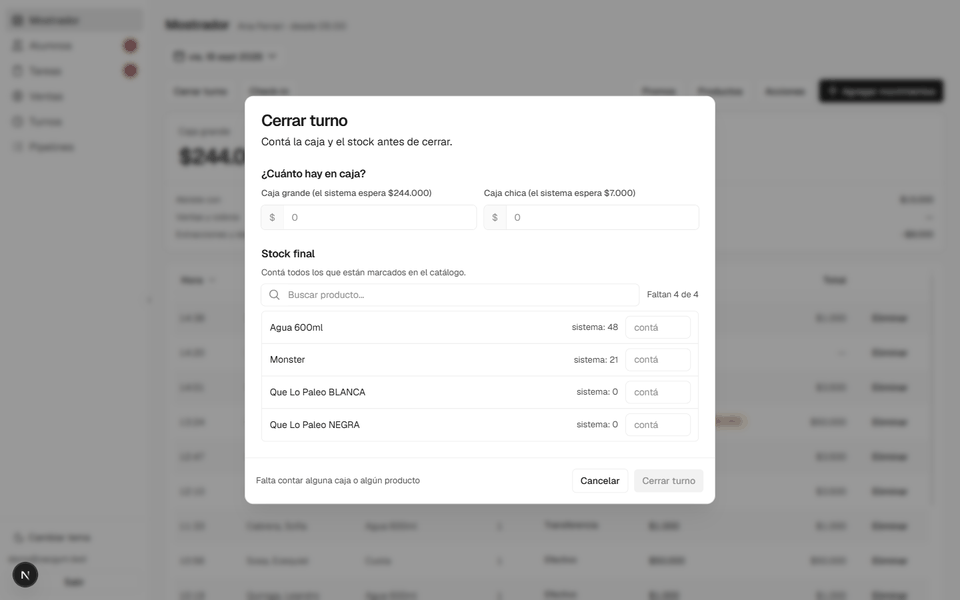
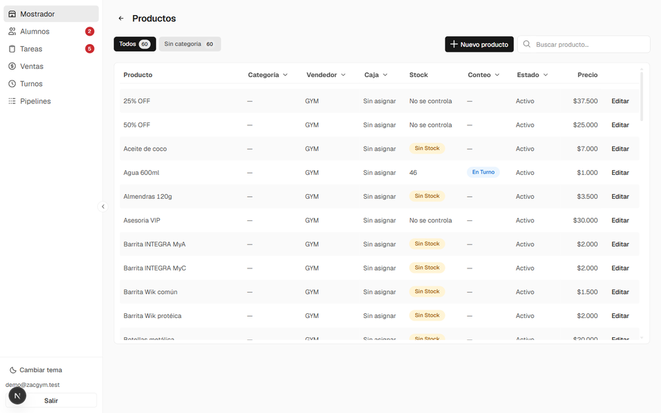
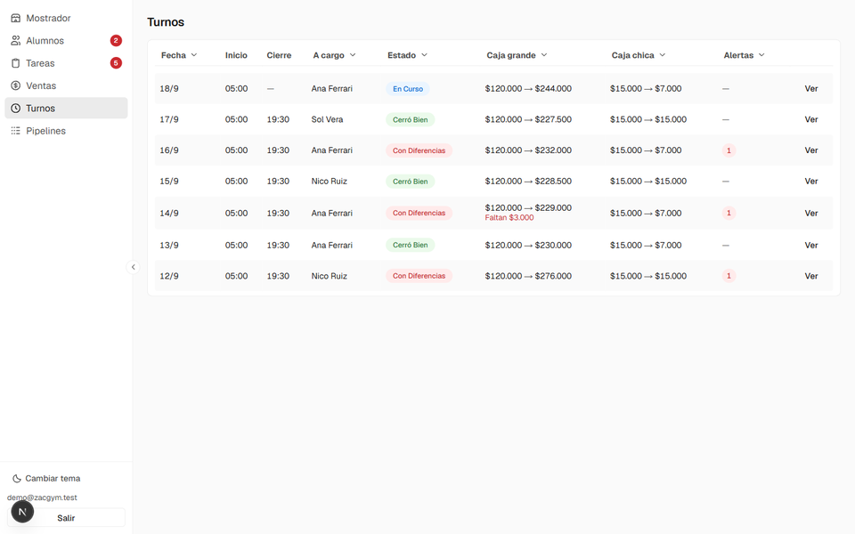
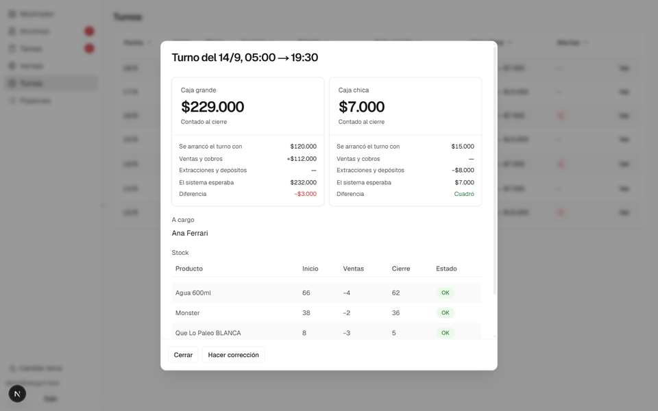

# Caja y stock

El gimnasio vende agua, bebidas, suplementos y barritas en el mostrador, y maneja
dos cajas (grande y chica). Antes, "falta plata" o "faltan aguas" era una
sospecha que no se podía probar ni ubicar en el tiempo.

El sistema lo convierte en un dato: cada turno **abre y cierra contando**, y el
sistema compara lo contado contra lo que esperaba.

## El cierre de turno

Al cerrar hay que contar las dos cajas y los productos marcados para conteo. Lo
que se cuenta se compara con lo que el sistema esperaba —lo que había al abrir,
más las ventas y los movimientos del turno— y la diferencia queda registrada.

Se cuentan solo los productos marcados en el catálogo, no los 60 del listado:
pedir 43 conteos por turno es garantizar que nadie los haga.

Si algo no cuadra, el cierre no se bloquea pero tampoco pasa en silencio: hay que
escribir la confirmación a mano para poder cerrar igual. La diferencia queda
guardada con el turno, el producto y el responsable.

## Lo que queda registrado

Cada turno cerrado muestra con cuánto abrió, con cuánto cerró, qué esperaba el
sistema y cuántas alertas dejó.

El detalle abre la comparación completa: caja por caja, y producto por producto
con lo que había al inicio, lo que se vendió y lo que se contó al cierre.

## Por qué importa el momento

Una diferencia en la **apertura** viene de antes de ese turno; una en el
**cierre** pasó durante. Esa distinción es la que permite ubicar el problema en
el tiempo en vez de acumular sospechas.

Y la misma información, mirada por producto en vez de por turno, es la que
detecta un faltante sistemático: **un faltante suelto es un error de conteo, el
mismo producto faltando seis veces no**. El sistema también valoriza la
diferencia, porque no es lo mismo que falte un agua que una proteína.

## Corregir sin romper el historial

Si aparece una venta que nadie anotó, o el conteo de apertura estaba mal, se
corrige, pero el esperado del cierre **no se recalcula desde cero**: se mueve por
la diferencia.

La razón está documentada en la migración que lo cambió: un turno abrió con 25
aguas, repusieron 32 en el medio, cerraron contando 57 y cuadraba. Al correr una
corrección, el esperado volvía a 25 e inventaba un sobrante de 32. El esperado
del cierre es una foto de lo que el sistema creía en ese momento y no se puede
reconstruir; lo que sí se puede es moverlo por la diferencia, y eso conserva lo
que haya pasado en el medio.
