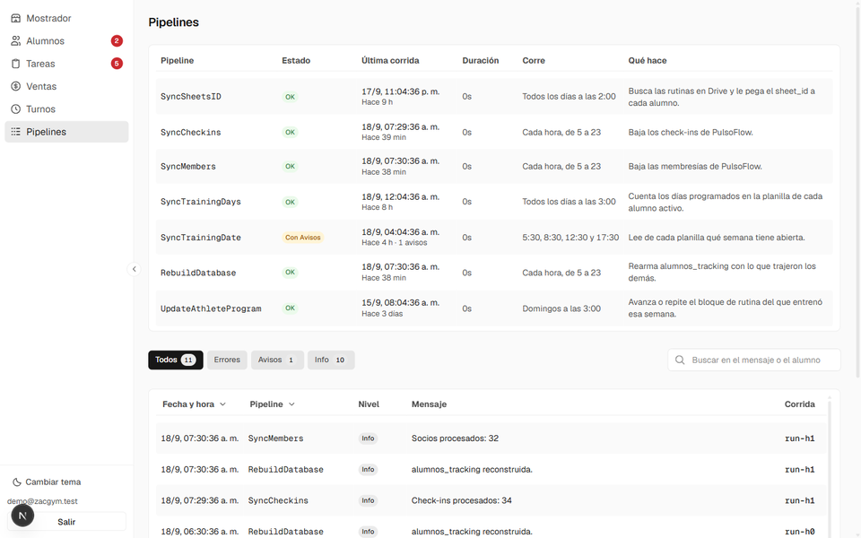

# Extracción de datos de PulsoFlow

PulsoFlow es la app donde el gimnasio registra los check-ins: cada vez que un
alumno entrena, queda la marca de que vino ese día. Es también donde viven las
membresías, con su plan y su fecha de vencimiento.

El problema es que **es una app cerrada**: no ofrece exportación de datos ni una
API documentada. Toda la información que el gimnasio genera todos los días vivía
adentro de un producto de un tercero, y desde afuera lo único que se podía hacer
era mirarla en pantalla.

Sin esos datos no hay nada de lo demás: ni rutinas automáticas, ni saber quién
debe, ni un listado de alumnos que se mantenga solo.

## Lo que hubo que resolver

### 1. Entender cómo habla la app con su servidor

No hay documentación, así que la fuente fue el tráfico de la propia app: qué
endpoints usa, qué parámetros acepta y qué forma tiene lo que devuelve. De ahí
salieron los tres que importan:

| Endpoint | Qué devuelve |
|---|---|
| `GET /services` | Las sedes/servicios de la cuenta. El `id` de acá es la llave de los otros dos. |
| `GET /checkins/service/{id}` | Los check-ins, paginados y filtrables por rango de fechas. |
| `GET /memberships/service/{id}` | Las membresías: plan, estado, vencimiento y los datos de contacto del alumno. |

Para saber qué guardar de cada objeto hay una función de reconocimiento que
imprime el primero crudo, sin escribir nada:

```js
function dumpMembershipShape() {
  const token = getAccessToken_();
  const serviceId = getServiceId_(token);
  const data = pfGet_('/memberships/service/' + serviceId, token);
  const arr = Array.isArray(data) ? data : (data.items || data.data || []);
  Logger.log('Total socios: ' + arr.length);
  Logger.log('PRIMER OBJETO:\n' + JSON.stringify(arr[0], null, 2));
}
```

De ese volcado salió el mapeo que hoy se guarda en la base. El objeto completo
igual se archiva en una columna `jsonb` (`raw`), así que si mañana hace falta un
campo que hoy no se está leyendo, está en la base y no hay que volver a bajar
nada.

### 2. La sesión, sin poder guardar una contraseña

El login de PulsoFlow es **por código de un solo uso al mail**, no por
contraseña. Un proceso automático que corre 19 veces por día no puede depender de
que alguien lea un mail y pegue un código.

La solución es hacer ese paso **una sola vez**, a mano, y quedarse con el refresh
token:

```js
function verifyOtp() {
  const res = UrlFetchApp.fetch(CONFIG.PF_AUTH_URL + '/auth/v1/verify', {
    method: 'post',
    contentType: 'application/json',
    headers: { apikey: CONFIG.PF_ANON_KEY },
    payload: JSON.stringify({ email: CONFIG.EMAIL, token: OTP_CODE_INPUT, type: 'email' }),
    muteHttpExceptions: true,
  });
  if (res.getResponseCode() >= 300) throw new Error('Codigo invalido o vencido: ' + res.getContentText());
  const data = JSON.parse(res.getContentText());
  PropertiesService.getScriptProperties().setProperty(PROP_REFRESH_TOKEN, data.refresh_token);
  Logger.log('Sesion guardada. Ya podes correr los sync.');
}
```

De ahí en adelante, cada corrida cambia ese refresh token por un access token
fresco y **guarda el nuevo refresh token**, porque el anterior queda invalidado
en el momento en que se usa:

```js
/** Rota el refresh token y devuelve un access token fresco. */
function getAccessToken_() {
  const props = PropertiesService.getScriptProperties();
  const refreshToken = props.getProperty(PROP_REFRESH_TOKEN);
  if (!refreshToken) throw new Error('No hay sesion. Corre requestOtp + verifyOtp primero.');
  const res = UrlFetchApp.fetch(CONFIG.PF_AUTH_URL + '/auth/v1/token?grant_type=refresh_token', {
    method: 'post',
    contentType: 'application/json',
    headers: { apikey: CONFIG.PF_ANON_KEY },
    payload: JSON.stringify({ refresh_token: refreshToken }),
    muteHttpExceptions: true,
  });
  if (res.getResponseCode() >= 300) {
    throw new Error('No se pudo refrescar la sesion (rehacer login): ' + res.getContentText());
  }
  const data = JSON.parse(res.getContentText());
  props.setProperty(PROP_REFRESH_TOKEN, data.refresh_token); // el viejo queda invalido
  return data.access_token;
}
```

Es una cadena: si una corrida se queda con un token nuevo y no lo guarda, la
siguiente ya no entra. Por eso el guardado va **antes** de devolver el token, y
por eso el error dice explícitamente qué hacer si la cadena se corta.

El refresh token vive en las Script Properties del proyecto, nunca en el código.
Lo único que sí está escrito en el código es la anon key de PulsoFlow, que es
pública por diseño.

### 3. Bajar los datos sin volver a bajar lo mismo todos los días

El sync de check-ins es **incremental**: arranca en el último check-in que ya
está guardado y pide de ahí en adelante, paginando de a 200.

```js
function syncCheckins() {
  const token = getAccessToken_();
  const serviceId = getServiceId_(token);

  // desde el ultimo check-in guardado, o desde BACKFILL_START si esta vacio
  const last = supaGet_('check_ins?select=check_in_time&order=check_in_time.desc&limit=1');
  const startIso = last.length ? last[0].check_in_time : CONFIG.BACKFILL_START;
  const endIso = new Date().toISOString();

  let offset = 0, total = 0;
  while (true) {
    const qs = '?limit=' + CONFIG.PAGE_SIZE + '&offset=' + offset
      + '&startDate=' + encodeURIComponent(startIso)
      + '&endDate=' + encodeURIComponent(endIso);
    const page = pfGet_('/checkins/service/' + serviceId + qs, token);
    if (page.length) {
      supaUpsert_('check_ins', page.map(checkinRow_), 'id', 'ignore');
      total += page.length;
    }
    if (page.length < CONFIG.PAGE_SIZE) break;
    offset += CONFIG.PAGE_SIZE;
  }
  Logger.log('Check-ins procesados: ' + total);
  return total;
}
```

Dos decisiones que hacen que esto se banque correr solo:

- **El estado vive en la base, no en el script.** La marca de "hasta dónde
  llegué" es el dato mismo. Si una corrida falla, la siguiente arranca donde
  quedó sin que nadie tenga que arreglar nada.
- **El upsert va por `id` con `ignore`.** Los rangos se pisan a propósito entre
  corridas; lo que ya está no se duplica ni se reescribe.

Corre **cada hora entre las 5 y las 23**, que es el horario en que el gimnasio
está abierto: de madrugada no hay check-ins que traer y no tiene sentido gastar
cuota de ejecución.

### 4. El histórico

El sync incremental sirve de ahí en adelante, pero arranca vacío. Para tener la
serie completa desde el día cero hay un script aparte,
[`pipelines/backfill/fetch_checkins.py`](../pipelines/backfill/fetch_checkins.py),
que baja todo el histórico de una y lo deja en un CSV:

```
python fetch_checkins.py --token "Bearer eyJhbGciOi..." --out checkins.csv
```

Es de una sola vez y por eso usa un token sacado del browser en lugar del
circuito de OTP: dura alrededor de una hora, que alcanza de sobra para bajar
todo.

## Adónde va lo que se baja

| Tabla | Qué guarda | Pipeline |
|---|---|---|
| `check_ins` | Un registro por asistencia, con el objeto original en `raw`. | `syncCheckins` |
| `alumnos_pulsoflow` | Una fila por membresía: plan, estado, vencimiento, contacto. | `syncMembers` |
| `alumnos_tracking` | El cruce de todo lo anterior con los días de entrenamiento y la planilla de cada alumno. | `rebuildTracking` |

`rebuildTracking` corre después de los otros dos, en la misma corrida, y es el
que deja la foto que lee la app: quién está activo, cuándo vence, cuándo vino por
última vez, cuántos días entrena y en qué semana de rutina está.

## Qué se hace con esos datos

Los check-ins no quedan guardados para mirarlos: son la entrada de las
automatizaciones.

- **Rutinas.** La corrida de los domingos arma la cola con los que hicieron al
  menos un check-in desde el lunes, y decide si a cada uno le avanza el bloque o
  se lo repite según cuántos días distintos entrenó. → [Rutinas](rutinas.md)
- **Cobranza.** El vencimiento de la membresía y la última asistencia se cruzan
  con lo que el alumno compró y pagó en el mostrador. De ahí sale saber quién
  debe, cuánto y desde cuándo. → [Alumnos](alumnos.md)
- **Actividad.** Los check-ins por día y por semana alimentan los gráficos del
  listado, que es donde se ve si alguien dejó de venir.

## Cómo se ve corriendo

Cada corrida deja sus líneas en `pipeline_logs`, y la app tiene una pantalla que
muestra el estado de los siete pipelines: cuándo corrió cada uno por última vez,
cuánto tardó, con qué frecuencia debería correr y si dejó avisos o errores.



La pantalla marca el atraso comparando la última corrida contra el horario
esperado, así que un trigger que se muere se ve sin tener que entrar a Apps
Script.

<!-- PENDIENTE: capturas del lado de PulsoFlow y de Apps Script.
     Ver docs/media/capturas-pendientes.md -->
