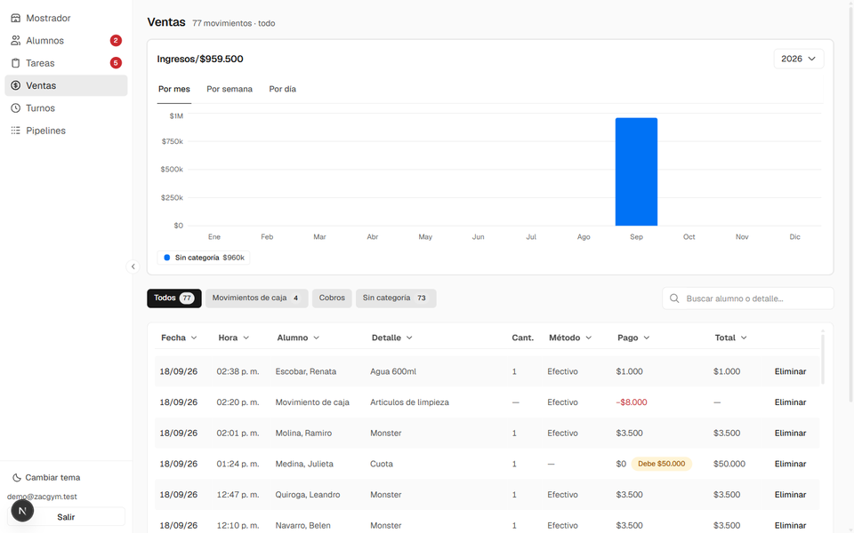
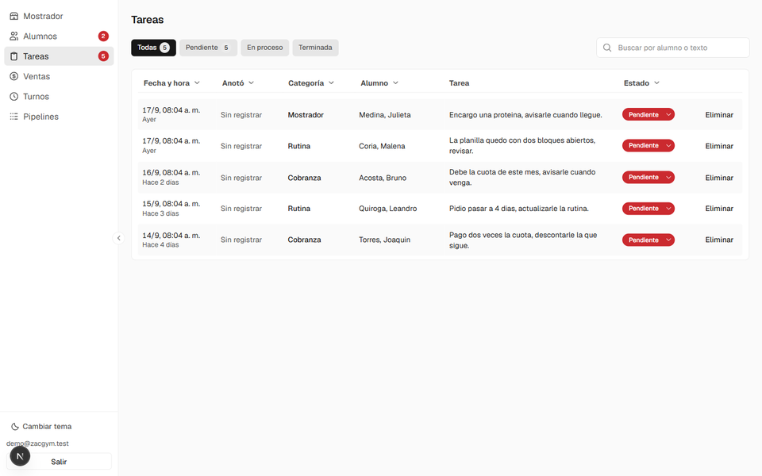

# Mostrador: ventas, cobranza y deudas

El mostrador es la pantalla del día a día: lo que se vende, lo que se cobra, lo
que entra y sale de la caja. Todo lo que se carga ahí queda pegado al turno
abierto y al alumno.

Se busca el alumno, se busca el producto, se elige el método de pago y se
confirma. Las ventas se cargan de a una y se confirman todas juntas al final, que
es como pasa en el mostrador real cuando entran tres personas a la vez.

## Lo que el sistema resuelve solo

**Avisa la deuda en el momento.** Al elegir al alumno, si debe algo de antes
aparece ahí mismo, antes de cobrarle:

**Separa la venta del pago.** Una venta puede quedar sin pagar (fiada), pagada en
parte, o pagada con transferencia y efectivo a la vez. El pago es una fila
propia, no una columna de la venta, y por eso cobrar una deuda vieja no altera la
caja del día en que se hizo la venta: la plata cuenta el día que entra al cajón.

**Congela el precio.** La venta guarda el precio con el que se vendió, así que
actualizar el catálogo no reescribe lo que ya se vendió.

**Exige un turno abierto.** Sin turno no se carga nada: es lo que permite saber
después quién anotó qué. Lo garantiza la base con un trigger, no la pantalla.

**Deja el saldo a favor a cuenta.** Si alguien paga de más, queda a favor y se
imputa contra lo que deba después.

## Las pestañas

| Pestaña | Para qué |
|---|---|
| Ventas | Lo que se vende: cuotas, kiosco, suplementos. |
| Extracciones y depósitos | Movimientos de caja que no son una venta (compras, retiros). |
| Cobrar deuda | Cobrar algo que quedó fiado antes, sin tocar la caja de aquel día. |
| Devolver dinero | La vuelta atrás, registrada en vez de improvisada. |

## Ventas

La pantalla de Ventas es el histórico completo, con su balance y sus filtros.

Las mensualidades tienen una vuelta más: hay que replicarlas en otros dos
sistemas fuera de esta app, y cada una lleva **dos tildes de carga, una por
sistema**. Con un tilde único, el que carga en un lado y se olvida del otro no
deja rastro; con dos, la mitad hecha se ve.

## Tareas

Lo que hay que hacer con un alumno y no se puede resolver en el momento —
avisarle que llegó su pedido, recordarle que debe, revisarle la rutina — queda
anotado contra ese alumno, no en un papel.

