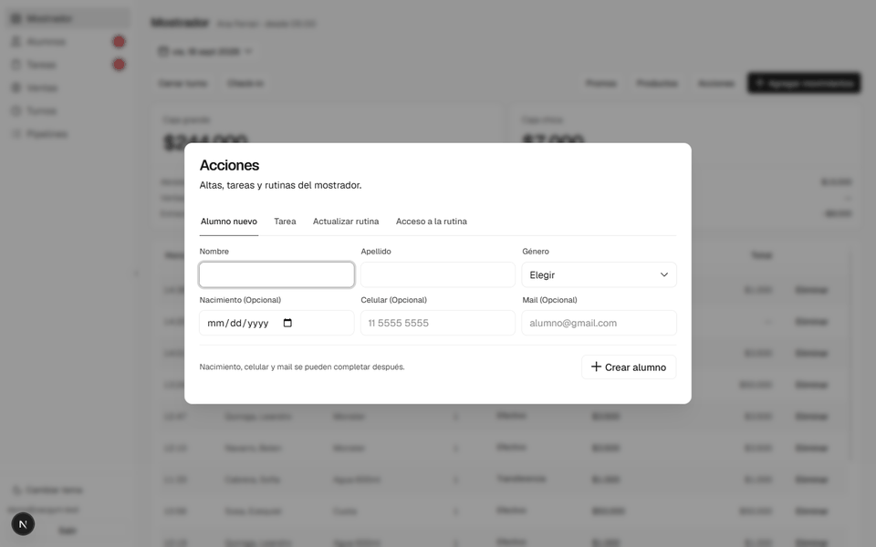
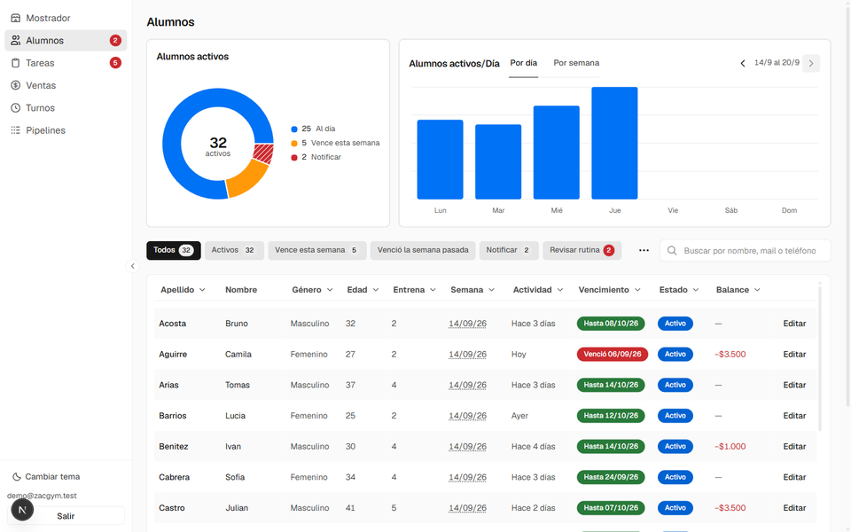

# Rutinas

Cada alumno tiene su rutina en una planilla de Google Sheets, dividida en bloques
de entrenamiento fechados por semana. Actualizarle la rutina a alguien es abrir
su planilla y dejar visible el bloque que le toca: el siguiente si entrenó lo
suficiente, o el mismo corrido una semana si no.

El dueño del gimnasio entrena al 90% de la gente que va — unos 270 alumnos
activos — y hacía eso a mano, uno por uno, todos los fines de semana. Eran unas
**20 horas por fin de semana**, sábado y domingo completos.

Hoy lo hace un trigger los domingos a las 3 de la mañana. El lunes las rutinas
ya están.

## Cómo decide qué hacer con cada alumno

Entra a la cola el que hizo **al menos un check-in desde el lunes**. Para avanzar
de bloque tiene que haber entrenado la mitad de los días que tiene asignados:

| Entrena | Tiene que haber entrenado |
|---|---|
| 1 o 2 días | 1 día |
| 3 o 4 días | 2 días |
| 5 o 6 días | 3 días |

Es `Math.ceil(dias / 2)`. El que no llega **repite**: el mismo trabajo, con la
fecha corrida una semana. El que no tiene días cargados también repite, porque
sin umbral no hay con qué juzgarlo y repetir nunca le saltea trabajo que no
hizo.

Cuenta **días distintos, no check-ins**: entrar dos veces el mismo día es un día.

Los datos de esa decisión son exactamente los que baja el pipeline de PulsoFlow
(→ [Extracción de datos](extraccion-pulsoflow.md)) cruzados con los días
programados que se leen de la planilla de cada alumno.

## Cómo sobrevive a los límites de Apps Script

Apps Script corta cualquier ejecución a los 6 minutos y 230 planillas no entran
en ese tiempo. La corrida está armada para que eso no importe:

- **No guarda la cola.** Cada ejecución la rearma y saltea al que ya tiene la
  semana escrita, que es lo que se guarda al terminar con cada alumno. El
  progreso vive en la base, así que avanzar dos veces al mismo alumno es
  imposible.
- **Se reprograma sola.** Si corta por tiempo, se vuelve a disparar a los 60
  segundos con un handler aparte, para poder cancelar la continuación sin tocar
  el trigger semanal.
- **Aísla lo que falla.** La planilla que rompe queda anotada y no se reintenta
  en esa corrida: sin eso, un archivo roto traba la cola para siempre. Al
  terminar llega un mail con los que fallaron.
- **Se puede ensayar.** Antes de la primera corrida, `verRutinasSemanales()`
  lista la cola entera con lo que le haría a cada uno, sin tocar una sola
  planilla.

El detalle completo, incluido qué hacer si un domingo no corre, está en
[`pipelines/README.md`](../pipelines/README.md).

## El lote a demanda, desde el mostrador

La corrida automática cubre la semana entera, pero siempre hay casos sueltos: el
que volvió de viaje, el alumno nuevo, el que pidió cambiar de días. Para eso el
mostrador tiene un botón que dispara **el mismo motor** para hasta 10 alumnos,
sin que nadie toque código ni entre a Apps Script.

Se elige el alumno y a qué semana queda fechada la rutina (la actual o la que
viene). El lote sale en tandas de 5 y en serie, no en paralelo: del otro lado hay
un solo proyecto de Apps Script con sus cuotas, y dos ejecuciones a la vez sobre
las mismas planillas es pedir problemas. El pedido sigue solo aunque se cierre el
modal, y avisa cuando termina.

Esta acción **busca y muestra, no reescribe**: los bloques ya vienen fechados en
la planilla y lo único que cambia es cuál queda a la vista. Esa es la diferencia
con la corrida de los domingos, que además repite semanas y levanta los RMs antes
de mover.

Queda registrada aparte en los logs (`MostradorRutinas`), a propósito: la
pantalla de Pipelines mide el atraso con la última corrida de cada nombre, y una
actualización a mano haría pasar por vivo a un trigger muerto.

## La semana que la planilla tiene abierta de verdad

Hay dos cosas parecidas que conviene no confundir:

- **La semana que el pipeline fijó** al avanzar el bloque.
- **La semana que la planilla tiene abierta de verdad**, que se lee cuatro veces
  por día abriendo el archivo.

Tenerlas separadas es lo que permite ver cuándo se separaron. Si un alumno tiene
dos bloques visibles a la vez, la planilla quedó a medio actualizar y cualquiera
de los dos puede ser el equivocado: el sistema no elige, guarda **"Revisar"** y
lo muestra en ámbar en el listado, linkeado a la planilla.

